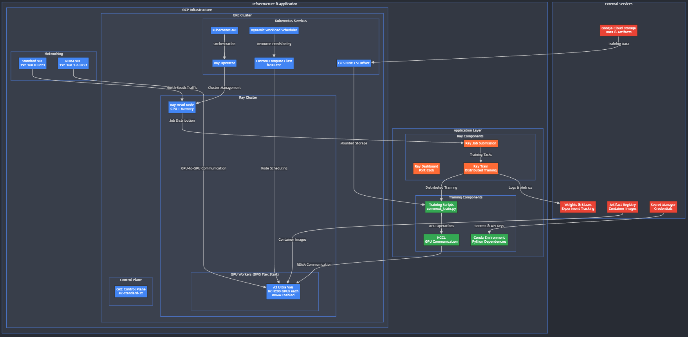

# Oasis 🏝️

## ML Training on GCP

A proof-of-concept for ML training infrastructure to Google Cloud Platform using
Ray on GKE with Dynamic Workload Scheduling (DWS), Custom Compute Class, and
H200 GPUs with
[RDMA support](https://cloud.google.com/vpc/docs/rdma-network-profiles).

## Overview

This POC demonstrates a modern, scalable, and open ML training infrastructure
with high obtainability that includes:

- **GKE Cluster** with multi-networking enabled
- **Google Infinity Band** networking with RDMA support
- **NCCL** for GPU-to-GPU communication
- **Dynamic Workload Scheduling (DWS)** for on-demand resource provisioning
- **Autoscaling** with Custom Compute Class
- **Distributed Training** using Ray Train
- **Conda support** for environment management
- **GCS Fuse** for cloud storage integration
- **Artifact Registry** for container images
- **Weights & Biases** integration for experiment tracking
- **GCP Secrets** for secure credential management

## Architecture

The infrastructure consists of:

- A3 Ultra VMs with 8x H200 GPUs per node
- RDMA networking for ultra-fast GPU communication
- Ray cluster with autoscaling capabilities
- Custom Compute Class for resource management
- Spot instance fallback for cost optimization



## Prerequisites

Before setting up the Oasis POC, ensure you install and configure the software
described in the following subsections.

### `gcloud` CLI

- [Install gcloud CLI](https://cloud.google.com/sdk/docs/install)
- [Initialize and authenticate gcloud](https://cloud.google.com/sdk/docs/initializing)

### `kubectl`

You can install `kubectl` via the `gcloud` CLI using:

```sh
gcloud components install kubectl
```

Alternatively, refer to
[Install kubectl](https://kubernetes.io/docs/tasks/tools/install-kubectl/) for
instructions.

[Configure kubectl for GKE](https://cloud.google.com/kubernetes-engine/docs/how-to/cluster-access-for-kubectl)
provides further details for working with `kubectl` and GKE.

### Conda

[Install Miniconda](https://www.anaconda.com/docs/getting-started/miniconda/install)
on your system.

You _may_ need to add `conda-forge` to your Conda channels:

```sh
conda config --add channels conda-forge
```

### `jq`

See the [`jq` download page](https://jqlang.org/download/).

### Docker (optional)

Docker may optionally be installed if you want to build your own container
images. Note that the demonstration image uses Cloud Build via the
[`build_image.sh` script](infra/build_image.sh).

You may choose to build your own container images

- [Install Docker Desktop](https://docs.docker.com/desktop/install/)
- [Docker Engine installation](https://docs.docker.com/engine/install/)
- [Configure Docker for GCP](https://cloud.google.com/artifact-registry/docs/docker/pushing-and-pulling#auth)

Podman is an alternative to Docker. Refer to
[Podman Installation Instructions](https://podman.io/docs/installation)

## Getting Started

### 1. Set up the infrastructure

Follow the steps in the [`infra/`](infra/README.md) directory to provision the
GCP resources, configure the GKE cluster, and set up all required services and
secrets.

_You must complete the infrastructure setup before running any Ray jobs or
examples._

### 2. Run Ray examples

Once the infrastructure is ready and the Ray cluster is up, navigate to the
`ray-examples` folder for sample jobs, benchmarking scripts,and usage examples.
