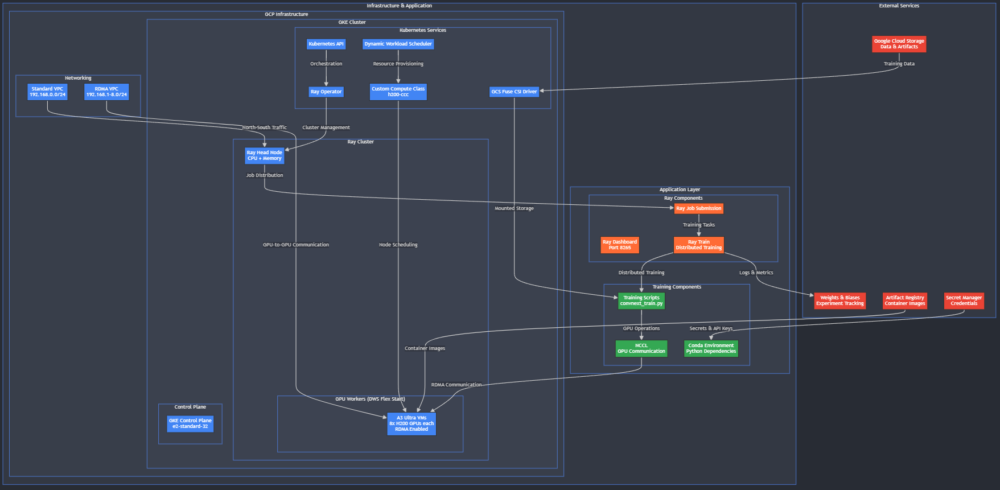

# Oasis 🏝️
<<<<<<< HEAD
## ML Training on GCP

A proof-of-concept for migrating ML training infrastructure to Google Cloud Platform using Ray on GKE with Dynamic Workload Scheduling (DWS), Custom Compute Class, and H200 GPUs with RDMA support.
=======
## tl;dr

1. update infra/TF/versions.tf
2. update infra/TF/variables.tf
3. update infra/TF/gpu-cluster.tfvars
4. change directory to ray-examples/docker
5. DOCKER_BUILDKIT=1 docker build -f Dockerfile . -t us-south1-docker.pkg.dev/gpu-launchpad-playground/ikwak-oasis-test/raycluster:latest
6. Create a new AR repo - https://docs.cloud.google.com/artifact-registry/docs/repositories/create-repos#create-repo-gcloud-docker
7. docker push us-south1-docker.pkg.dev/gpu-launchpad-playground/ikwak-oasis-test/raycluster:latest ref - https://docs.cloud.google.com/artifact-registry/docs/docker/pushing-and-pulling
8. update ray-examples/ray-cluster-ccc.yaml (container image name, minReplica size, bucketName)
>>>>>>> 932bff9 (fleep)

## Overview

This POC demonstrates a modern, scalable, and open ML training infrastructure with high obtainability that includes:

- **GKE Cluster** with multi-networking enabled
- **Google Infinity Band** networking with RDMA support
- **NCCL** for GPU-to-GPU communication
- **Dynamic Workload Scheduling (DWS)** for on-demand resource provisioning
- **Autoscaling** with Custom Compute Class
- **Distributed Training** using Ray Train
- **Conda support** for environment management
- **GCS Fuse** for cloud storage integration
- **Artifact Registry** for container images
- **Weights & Biases** integration for experiment tracking
- **GCP Secrets** for secure credential management

## Architecture

The infrastructure consists of:
- A3 Ultra VMs with 8x H200 GPUs per node
- RDMA networking for ultra-fast GPU communication
- Ray cluster with autoscaling capabilities
- Custom Compute Class for resource management
- Spot instance fallback for cost optimization

## Prerequisites

Before setting up the Oasis POC, ensure you have:

**gcloud CLI** installed and authenticated
   - [Install gcloud CLI](https://cloud.google.com/sdk/docs/install)
   - [Initialize and authenticate gcloud](https://cloud.google.com/sdk/docs/initializing)

**kubectl** installed and configured
   - [Install kubectl](https://kubernetes.io/docs/tasks/tools/install-kubectl/)
   - [Configure kubectl for GKE](https://cloud.google.com/kubernetes-engine/docs/how-to/cluster-access-for-kubectl)

**Docker** installed (for building container images)
   - [Install Docker Desktop](https://docs.docker.com/desktop/install/)
   - [Docker Engine installation](https://docs.docker.com/engine/install/)
   - [Configure Docker for GCP](https://cloud.google.com/artifact-registry/docs/docker/pushing-and-pulling#auth)

## Getting Started

1. **Set up the infrastructure first:**  
   Follow the steps in the `infra` directory to provision the GCP resources, configure the GKE cluster, and set up all required services and secrets.  
   _You must complete the infrastructure setup before running any Ray jobs or examples._

2. **Docker Image Setup (Optional):**  
   If you want to build a custom Ray image with additional dependencies, follow the instructions in the [`docker/README.md`](docker/README.md) file. This step is optional as the current configuration uses a pre-built image that's ready to use.

3. **Run Ray examples:**  
   Once the infrastructure is ready and the Ray cluster is up, navigate to the `ray-examples` folder for sample jobs, benchmarking scripts, and usage examples.
<<<<<<< HEAD
=======

>>>>>>> 932bff9 (fleep)
